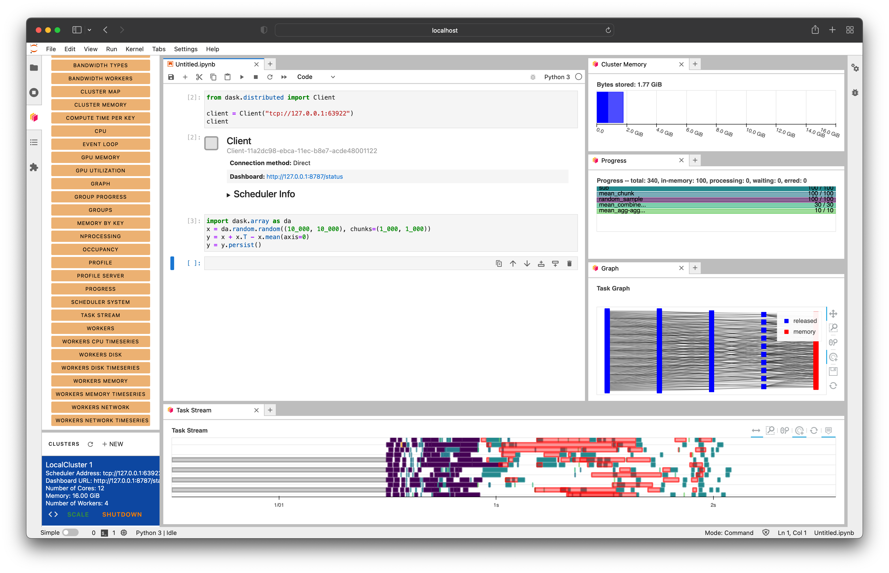

# Dask JupyterLab Extension

[](https://travis-ci.org/dask/dask-labextension) [](https://www.npmjs.com/package/dask-labextension) [](https://www.npmjs.com/package/dask-labextension) [](https://libraries.io/npm/dask-labextension)

This package provides a JupyterLab extension to manage Dask clusters,
as well as embed Dask's dashboard plots directly into JupyterLab panes.



## Explanatory Video (5 minutes)

<a href="http://www.youtube.com/watch?feature=player_embedded&v=EX_voquHdk0 "
   target="_blank">

</a>

## Requirements

JupyterLab >= 1.0
distributed >= 1.24.1

## Installation

To install the Dask JupyterLab extension you will need both JupyterLab,
and [Node.js](https://nodejs.org/), with at least version 12.
These are available through a variety of sources.
One source common to Python users is the conda package manager.

```bash
conda install jupyterlab
conda install -c conda-forge nodejs
```

This extension includes both a client-side JupyterLab extension and a server-side
Jupyter notebook extension. Install via pip or conda-forge:

```bash
pip install dask_labextension
```

```bash
conda install -c conda-forge dask-labextension
```

and build the extension as follows:

```bash
jupyter labextension install dask-labextension
jupyter serverextension enable dask_labextension
```

If you are running Notebook 5.2 or earlier, enable the server extension by running

```bash
jupyter serverextension enable --py --sys-prefix dask_labextension
```

## Configuration of Dask cluster management

This extension has the ability to launch and manage several kinds of Dask clusters,
including local clusters and kubernetes clusters.
Options for how to launch these clusters are set via the
[dask configuration system](http://docs.dask.org/en/latest/configuration.html#configuration),
typically a `.yml` file on disk.

By default the extension launches a `LocalCluster`, for which the configuration is:

```yaml
labextension:
  factory:
    module: 'dask.distributed'
    class: 'LocalCluster'
    args: []
    kwargs: {}
  default:
    workers: null
    adapt:
      null
      # minimum: 0
      # maximum: 10
  initial:
    []
    # - name: "My Big Cluster"
    #   workers: 100
    # - name: "Adaptive Cluster"
    #   adapt:
    #     minimum: 0
    #     maximum: 50
```

In this configuration, `factory` gives the module, class name, and arguments needed to create the cluster.
The `default` key describes the initial number of workers for the cluster, as well as whether it is adaptive.
The `initial` key gives a list of initial clusters to start upon launch of the notebook server.

In addition to `LocalCluster`, this extension has been used to launch several other Dask cluster
objects, a few examples of which are:

- A SLURM cluster, using

```yaml
labextension:
    factory:
      module: 'dask_jobqueue'
       class: 'SLURMCluster'
       args: []
       kwargs: {}
```

- A PBS cluster, using

```yaml
labextension:
  factory:
    module: 'dask_jobqueue'
    class: 'PBSCluster'
    args: []
    kwargs: {}
```

- A [Kubernetes cluster](https://github.com/pangeo-data/pangeo-cloud-federation/blob/8f7f4bf9963ef1ed180dd20c952ff1aa8df54ca2/deployments/ocean/image/binder/dask_config.yaml#L37-L42), using

```yaml
labextension:
  factory:
    module: dask_kubernetes
    class: KubeCluster
    args: []
    kwargs: {}
```

## Development install

As described in the [JupyterLab documentation](https://jupyterlab.readthedocs.io/en/stable/developer/extension_dev.html#extension-authoring) for a development install of the labextension you can run the following in this directory:

```bash
jlpm install   # Install npm package dependencies
jlpm run build  # Compile the TypeScript sources to Javascript
jupyter labextension install  # Install the current directory as an extension
```

To rebuild the extension:

```bash
jlpm run build
```

If you run JupyterLab in watch mode (`jupyter lab --watch`) it will automatically pick
up changes to the built extension and rebundle itself.

To run an editable install of the server extension, run

```bash
pip install -e .
jupyter serverextension enable --sys-prefix dask_labextension
```

## Publishing

This application is distributed as two subpackages.

The JupyterLab frontend part is published to [npm](https://www.npmjs.com/package/dask-labextension),
and the server-side part to [PyPI](https://pypi.org/project/dask-labextension/).

Releases for both packages are done with the `jlpm` tool, `git` and Travis CI.

_Note: Package versions are not prefixed with the letter `v`. You will need to disable this._

```console
$ jlpm config set version-tag-prefix ""
```

Making a release

```console
$ jlpm version [--major|--minor|--patch]  # updates package.json and creates git commit and tag
$ git push upstream master && git push upstream master --tags  # pushes tags to GitHub which triggers Travis CI to build and deploy
```
